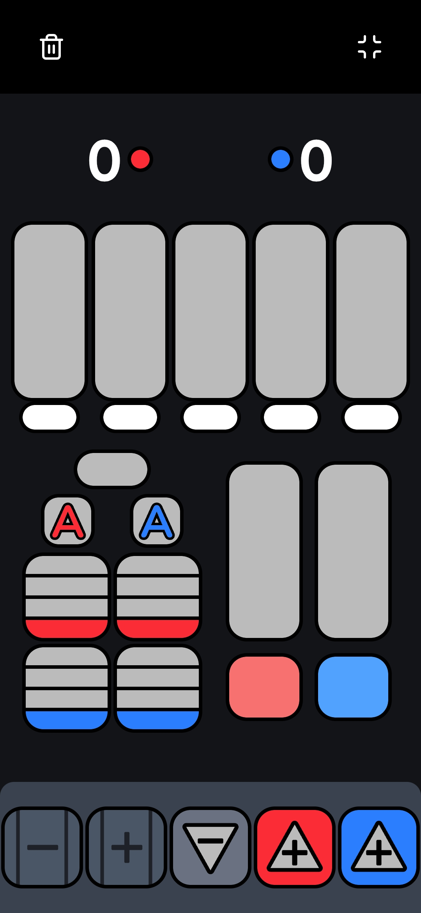
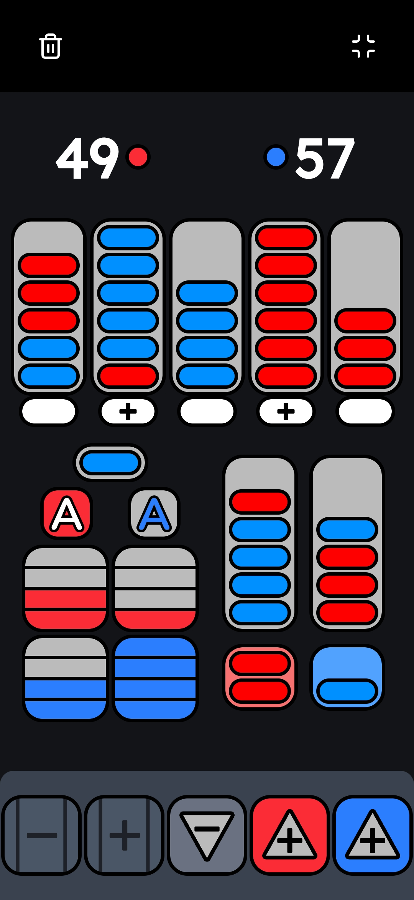

# VRC Scorekeeper

A lightweight web application for tracking VEX Robotics Competition match scores. Built for teams who need a simple, reliable scoring tool.

## Features

- Real-time score tracking
- Stake counter management
- Mobile and desktop compatible
- Offline functionality
- Dark mode interface

## Usage

Access the app at [ittskk.github.io/vrcscorekeeper](https://ittskk.github.io/vrcscorekeeper/)

Install as a PWA on mobile devices for offline access.

## UI

  

  
  

## Compatibility

- All major desktop browsers
- iOS and Android devices
